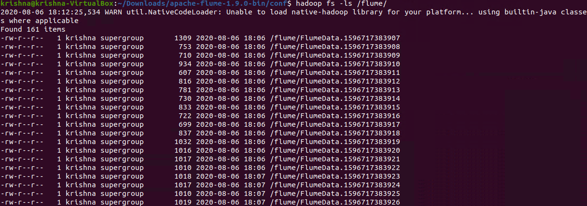

# Flume Write Gradually Growing logs into HDFS
-----------------------

### Flume

Flume is a standard, simple, robust, flexible, and extensible tool for data ingestion from various data producers (webservers) into Hadoop.  

### Pros

* Central master server manages all nodes  

### Flume-ng 

  

In the above screenshot, we can see the flume-ng command running an hw agent with flume.conf configuration.  

### Writing into output.txt

  

In the above screenshot, linux_message_3000lines.txt start writing logs to ouput.txt file with .2 seconds of sleep.  

### Writing of data into HDFS

  

In the above screenshot, flume is start writing data into hdfs.  

### Output

  

In the above screenshot, we can see that all data of output.txt is present in multiple files.  

**Created by:**  
**Name: Krishna Kumar Singh**  
**Email: krishnaai265@gmail.com**  
**Phone: +91-9368754996** 
